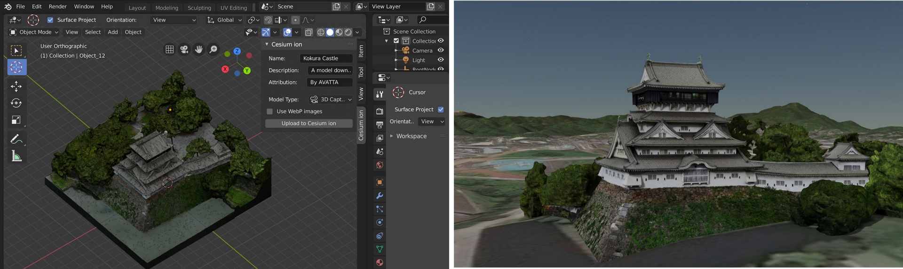

  

The Cesium ion Blender add-on enables you to publish and stream even the most massive of 3D Models on the web with 3D Tiles.

With 3D Tiles, even multi-gigabyte models can be streamed to any device without having to download the entire model up front. By loading 3D Tiles into CesiumJS, you can fuse your model with other datasets, add geospatial context to place it at a real world location, or overlay additional details and analysis.

Learn more at https://cesium.com

    Kokura Castle (left) loaded into Blender and (right) fused with Cesium World Terrain and imagery in CesiumJS after being tiled with ion.

## Installation

Read the [installation guide](https://cesium.com/docs/tutorials/integrating-with-blender/) to get started.

## Contributing

Interested in contributing?  See [CONTRIBUTING.md](CONTRIBUTING.md). :heart:
